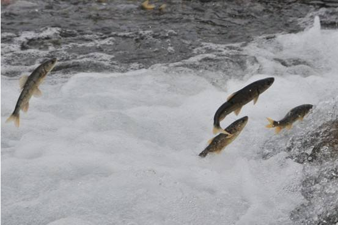

# 世界公认最健康的作息时间表

> 你写PPT时，阿拉斯加的鳕鱼正跃出水面，你看报表时，梅里雪山的金丝猴刚好爬上树尖。你挤进地铁时，西藏的山鹰一直盘旋云端，你在会议中吵架时，尼泊尔的背包客一起端起酒杯坐在火堆旁。有一些穿高跟鞋走不到的路，有一些喷着香水闻不到的空气，有一些在写字楼里永远遇不见的人。

这段文案曾令无数职场人着迷，我们何尝不是渴望拥有这样的人生，比起“旅行”，在这个不努力就滚蛋的大城市，我们只能默默地，转身回到岗位上继续奋斗，活在当下的我们，你是如何安排好最适合自己的作息的呢？

| 时间 | 名称 |
| ---- | ---- |
| 7:00 | 迎着清晨的阳光起床 |
| 7:20-8:00 | 营养全面的早餐 |
| 8:30-9:00 | 避免激烈运动 |
| 9:00-10:00 | 做困难性工作 |
| 10:30 | 让眼睛休息一下 |
| 11:00 | 吃点水果 |
| 12:00-12:30 | 午餐 |
| 13:00-14:00 | 午睡 |
| 14:00-16:00 | 做创意性工作 |
| 16:00 | 喝杯酸奶 |
| 16:10-19:00 | 做细致性工作 |
| 19:00 | 最佳的运动时间 |
| 20:00 | 看电视或书 |
| 22:00 | 洗个热水澡 |
| 22:30 | 上床睡觉 |

**7:00 迎着清晨的阳光起床**

一杯温水是早起之后的必需品，能让你获得一天最好的开始。

**7:20-8:00 营养全面的早餐**

一顿优质的早餐，能让你一整天都充满活力。

**8:30-9:00 避免激烈运动**

早上是人体免疫系统最弱的时候，不要做剧烈的运动，走路上班是很好的选择，健康又惬意。

**9:00-10:00 做困难性工作**

上午，人脑最清醒犀利，应该用来做最有难度的事。比如攻克工作的难题，给复杂的报告列提纲等等，充分利用好上午清醒的大脑。

**10:30 让眼睛休息一下**

一晃就十点半了，起来走动走动，眺望一下远方，做一做眼保健操，让眼睛舒缓舒缓。

**11:00 吃点水果**

上午工作得差不多了，该吃点水果了。上午是一天吃水果的最佳时机，因为上午人体最适合吸收水果里的营养。

**12:00-12:30 午餐**

午餐要吃饱，中午应该补充足够的蛋白质，豆类食品是最佳选择。虽然是午饭，久坐办公室的人也不要吃得太油腻。

**13:00-14:00 午睡**

午饭后的时间很宝贵，最好用来小睡一觉。有的人喜欢在中午网上购物或者是打激烈的游戏，这反而会让大脑处于过度紧张的状态，造成下午身体的疲惫。

**14:00-16:00 做创意性工作**

午后是人思维最活跃的时间，非常适合做一些创意性的工作。想一想工作中的创新，即使是微小的改善，日积月累也会有巨大的成就。

**16:00 喝杯酸奶**

四点左右，喝杯酸奶，能补充身体流失的血糖，而后将要投入到一天最密集的工作中了。

**16:10-19:00 做细致性工作**

四点到七点，身体和大脑都处于一天的巅峰状态，这时候我们应该做细致而密集的工作。

**19:00 最佳的运动时间**

下班之后稍微吃点东西，晚饭不要吃太多，三分饱即可。晚饭后稍微歇一会儿再开始运动。先散步，再慢跑，是非常健康的运动方式。

**20:00 看电视或书**

运动之后可以看看电视，或打开你阅读计划中的书放松阅读。最好的选择还是在娱乐休闲中延绵不绝地思考工作，这样会碰撞出意想不到的火花。

**22:00 洗个热水澡**

时间差不多就该洗个澡了，让身体彻底舒缓下来，洗去一天的疲惫。

**22:30 上床睡觉**

十一点，人体的各个器官都开始处于休息期了，不要违背身体的自然规律，放松睡一个好觉，明天又是美好的一天！

**身体健康，是一笔只赚不赔的投资，小伙子，是时候给自己制定一张作息时间表了！**

