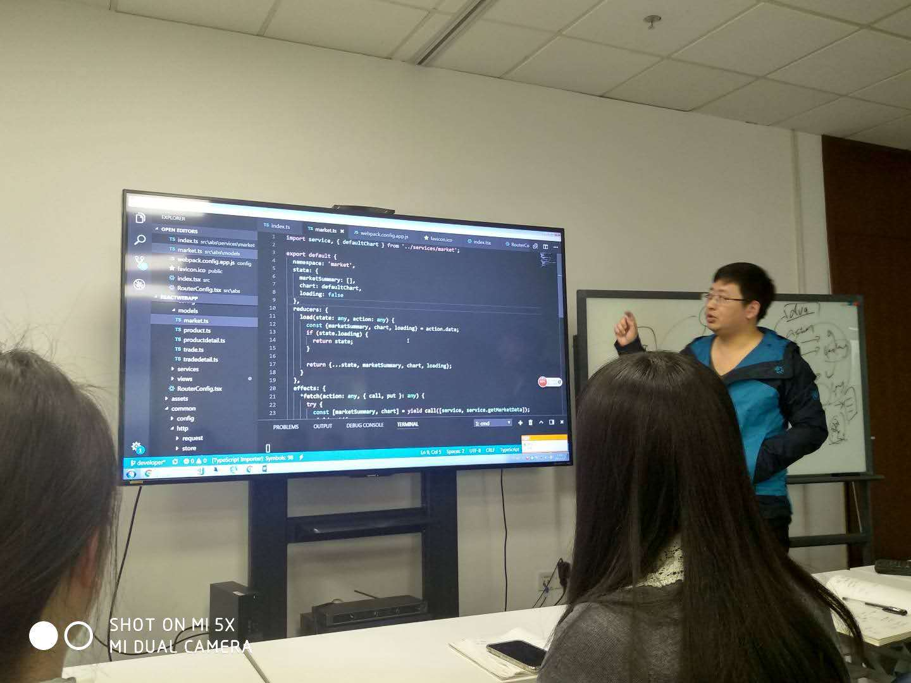
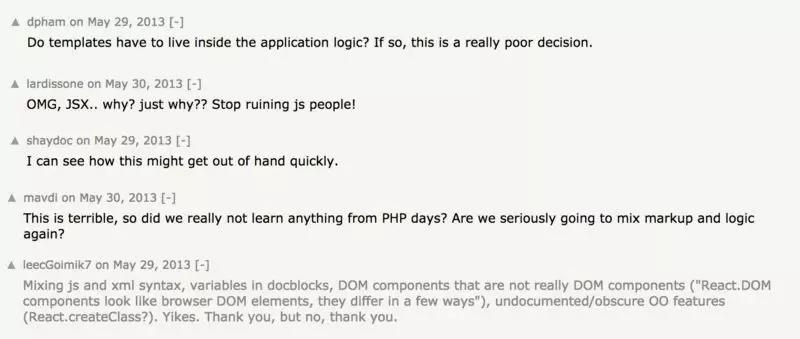
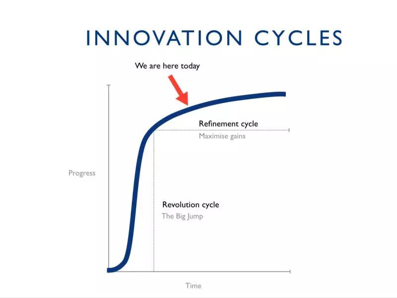

# 为什么刘立军说 React 是 UI 的未来

> 我们曾经认为太阳围绕地球运行，把瘟疫看作神对人类的惩罚，而现在我们坚信 MVC 架构和双向数据绑定就是构建 Web UI 程序的最佳方式。

过去，人们没有更好的方式来探寻这个世界，由于认知的局限，人们对这些“误解”深信不疑。最终，天文学家证明了日心说，医生发现疾病是由细菌引起的。类似的，React 引入了单向数据流的概念。

这些发现都没有立刻得到大众认可。伽利略的理论被认定为异端邪说。Semmelweis 博士发现疾病源于细菌，然而同事不接受他的这一研究成果，最后遗憾的在一庇护所中含恨而终。而如今，我们仍然误认为所有的 UI 架构都是平等的。

我坚信 React，或者类似的东西，将是用户界面开发的未来。此刻，希望你不要立刻跳到文章末尾表达赞同或者反对意见，请先耐心看完文章正文，我会告诉你我这么认为的理由。

## React 的视野更为广阔

React 是一个由聪明人创造的聪明想法的集合。当 React 首次公布时，主要的卖点在于它的渲染方式：如果将应用程序结构与底层渲染 DOM 分开，我们可以实现声明式的视图渲染语法，同时仍然能够应用最优的 DOM 突变。

它的思想别具一格，比如，它认为通过将代码分离为 HTML、JavaScript 和 CSS 来跨越技术边界的方法并没有实质性的效果。React 认为，为了创建具有高内聚和低耦合的程序，我们最好将 UI 的呈现、行为和状态放在一个 JavaScript 文件里。这种方法为开发人员带来了阻碍，那就是在普通的 JavaScript 中难以创建 UI。鉴于此，React 附带了一个名为 JSX 的扩展语法。

很多开发者非常讨厌 JSX 扩展语法。如果你不是 Web 前端开发人员，也许很难理解开发者为什么会对扩展语法充满排斥情绪。

React 发布时激起了热烈的讨论

没有人愿意看到自己深信不疑的东西被否定，这是人的天性。因此，在高速发展的前端领域，React 的核心价值经常被忽略。

## React 是一个组件平台

React 的核心在于它的组件。虚拟 DOM 是一项很酷的技术，但它只是一个实现细节，如果 React 不需要它也可创建，那它也就没有存在的必要。JSX 是一项不错的技术，但它只是语法糖。

如今，组件已经是一个非常成熟的概念了，它在 React 之前就已经存在。当 React 发布时，Web 组件规范早已标准化。就像伽利略并非第一个发现日心说的人一样，组件也不是 React 发明的，React 只是重新定义了它。

React 组件的优点主要在于它的可组合性和封装性。其次是它的函数组件和多用途。下面我将对其进行详细说明：

- **可组合性** 使我们能够使用多个小的程序来组件一个大的程序，这些小程序使用的模板并不依赖其他组件，代码可以独立于系统中的其他代码进行自由修改、删除和替换，甚至可以在未来的代码存在之前编写。

- **封装** 包含组件的整个表现、行为和状态。这意味着外部代码不能影响其行为，除非包装成了一个组件。

- **函数式** 风格的编程接收 Props 进行渲染，这使得 React 组件更加健壮，它们的行为易于记录和理解，从而使得开发人员能够使用其他人开发的组件，而无需了解其工作原理。

- **多用途** 意为组件既可以是负责数据和行为的容器组件（控制器），也可以是呈现组件的视图。这种分离的方式一直是 MV * 体系结构的关键，而优雅的 React 组件 API 可以在保留可组合性和封装性的同时，实现真正的分离。

这种小巧且集中的组件抽象方式提供了开发者需要的所有特性，比如：易于学习和记忆，更好的用户使用体验，并且能够生成便于维护和协作的程序。

还有一个我没提到的组件，事实上，这是最重要的组件。

## 组件是创新原语

虽然我是 React 的忠实支持者，但我不得不承认 React 并不完美；React 核心团队正在积极对其进行优化，一些新的想法在不断讨论、实施和丢弃。虽然目前 React 的生态系统很强大，包含了大量的库、模式和多种实践，但它依然有提升空间。我们甚至不能确定是否需要高阶组件、渲染 Props、函数式 Props、或者组件的组件！

**虽然丰富的选项有时会令人疲倦，但这正是 React 组件模型的真正优势所在。** 有了通用的、小型的、可组合的、灵活可靠的构建模块，我们就可以在不丢弃现有工作的情况下讨论、测试和接受新的想法。

遍布世界各地的个人开发者构建了像 Redux、Apollo 或样式化组件这样革命性的库，应用开发者可以将这些新工具与现有工具一起使用，而无需修改现有的代码，并且可以不影响其他模块的情况下单独替换某些特定的模块，这都令我难以置信。

这些库各自都在 React 领域之外实现了复杂的功能，但他们却没有相互限制，因为这些工具都可以利用组件组合模型 。**因此，React 组件模型不仅仅是一个 UI 原语，它是一个创新原语。**

与渐进式 JavaScript 的不同之处在于，React 采用新工具时不必重构大量的代码。与 Vue 或者 Angular 这样的整体型框架不同，React 具有足够的灵活性来应对不可避免的变化。

## 变化不可避免

平台应当能够适应变化，这一点非常重要，因为 **变革总是不可避免并且代价高昂。**

聪明人不会突然停止对问题的观察，并为其提出解决方案。人们不会停止对存在的限制感到沮丧，并且不会停止对自由的追求。作为开发者，发现更好的工具时，我们也不会强忍着不去使用。无论你多想保持现状，历史的车轮总是滚滚向前。

当改变发生时，一个系统最理想的状态是它能够适应变化，如果完全替换代价将非常巨大。

在过去十年的框架战之后，我们现在生活在前所未有的繁荣与和平时期。React 等工具使我们能够构建和维护杰出的产品。

如果我们的工具阻碍了进步，我们必须保持前进而不得不放弃它们。革命的代价是毁灭现有：我们将不得不更换所有的库，重新认识新方法，重新培训我们的团队，重复我们的错误，改写或重构大量的代码，而不是专注于我们正在创造的产品。

## 革命无法抗拒

创新的阶段分为两部分：

- 快速改革的爆发期

- 缓慢增长的长尾期

革命期增长迅速，细化阶段增速平缓

React 是一场革命。它推翻了当前的最佳实践，几乎在一夜之间对开发人员体验方面进行了重大改进。目前我们正在快速进行迭代，我们对这种快速的创新已经习以为常，但是不久之后，创新的速度将会趋于平缓。

但曲线并不会真正决定创新的速率。只要我们保持创造活力和创新精神，同时开发者积极做决策，我们的生态系统依然能够快速变化。

## 让我们编写软件积极应对变化

无论我们是在 React 生态系统内部使用其他框架，构建无框架的渐进式 Web 应用程序，还是根本不构建与 Web 平台相关的软件，我们都可以从 React 及其生态系统中学习这些经验教训，能够灵活应对变化而不需要颠覆现有的代码。

- **用小模块来构建大系统：** 使用多个小巧的特定功能单元来构建软件，尽量避免使用整体性的架构。设计 API 和接口时要仔细考虑，方便他人使用。

- **让代码易于复制和删除，而不容易更改：** 相比于继承和混入最好使用组合。把行为进行封装。把一件事做好。

- **优先为人而不是机器编写代码：** 让代码变得更好理解。编写代码时尽量意图简单明了，不要过于学术。做到命名准确，书写必要的文档，保证代码规范，方便他人使用。

- **密切使用编程语言：** React 能够利用新的 JavaScript 语言功能和生态系统工具，因为它只使用 JavaScript 而已，虽然它有一套 JSX 语法。避免使用基于字符串的 DSL 和非惯用接口，因为这会降低兼容性。

- **除非逼不得已，否则不要打破现有状态：** 稳定性本身就是一种价值，因为改变会导致额外的工作和浪费产生，或者在最糟糕的情况下，甚至会发生诸如废弃 AngularJS 这样的结局。要么最初就更换技术方案，否则最好不要在中途进行替换，使用代码模块或类似的工具来适应变化。在你自己的代码中，不要仅仅为了它而采用新的库，请充分衡量成本与收益。

- **保持开放的态度：** 如果遵循了前面的规则，那么最后这一条也是必然的。有时候，新的想法也许让人恐惧，变化可能会带来不便，但革命总是偶尔会发生。不要太过一成不变，保持开放的态度，听取人们的意见。

## React 是开发者的福音

UI 领域技术更迭非常之快，简直变幻莫测，我相信 React 会是 UI 的终极选择。

虽然我个人并未重视虚拟 DOM，但它已被证明是 React 最具前景的功能之一。由于虚拟表现层和 UI 实现层的分离，React 非常适合服务器端渲染和通用 Web 应用程序。原生移动平台是用户界面开发中难以忽略的一部分；React Native 正好可以在该领域为我们提供大力帮助，recoil 让 React 在 Kotlin 和 Swift 中都大有可为。ReasonML 和 ReasonReact 可以帮助我们将 React 范例扩展到 JavaScript 之外的平台。随着未来增强和虚拟现实技术的蓬勃发展，我希望 React VR 和其他类似的实验可以帮助我们预测风暴。

最终，React 将被其他东西取代。我们还不知道强制函数会是什么，也许是 WebAssembly，我们不知道接下来会发生什么。不管怎样，我都会怀以激动的心情期待它。

就目前而言，由于 React 的强大存在，我相信短时间内 UI 领域会保持专一、稳定并欣欣向荣。