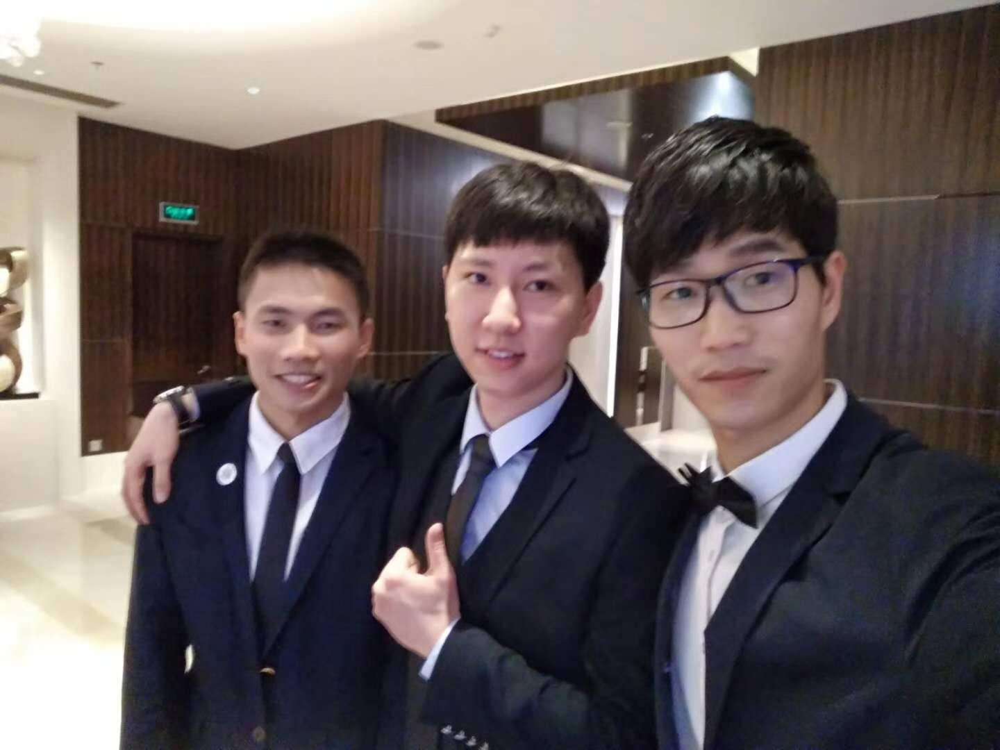
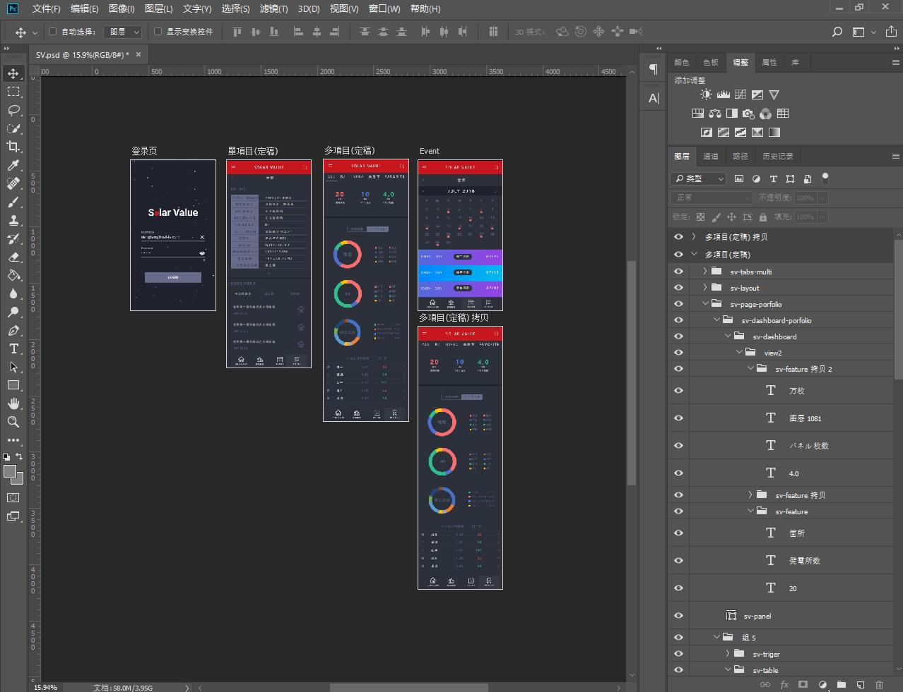
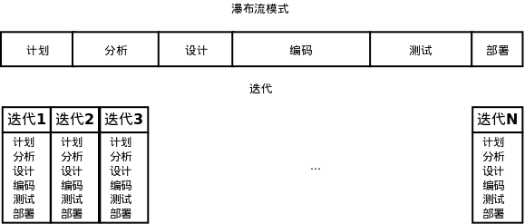
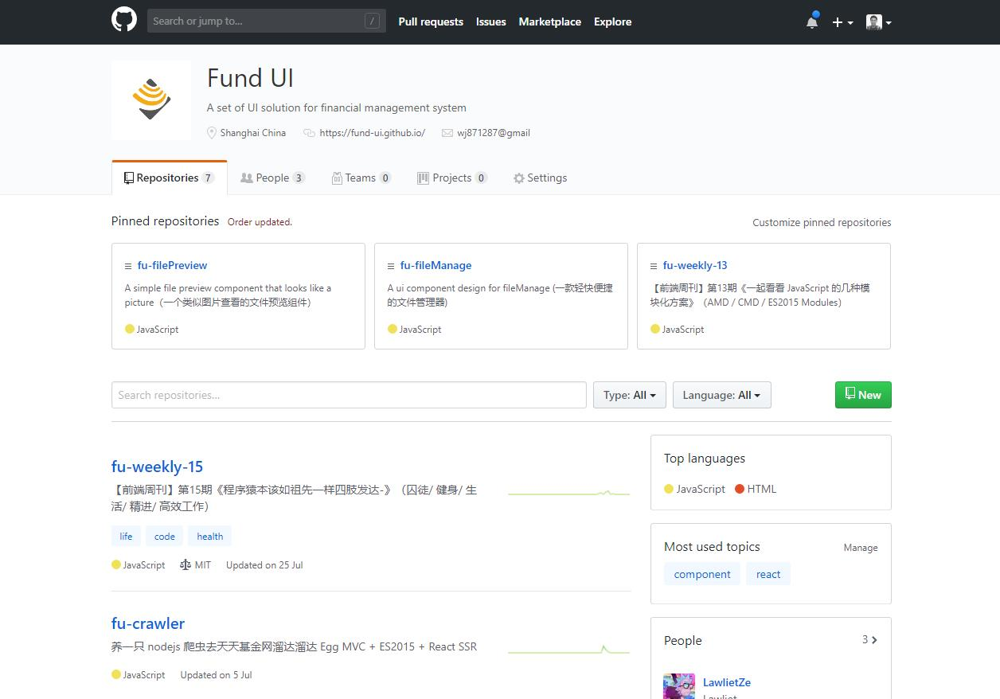

# 我终于从 SAFS 毕业了

就当是一个年终总结吧，文中也许很多观点不够成熟，但我坚信，以理性批判的眼光审视过去，能够让我们更好的拥抱未来。

## 前后分离的启蒙

我写这篇文章时已是 **2018** 年的秋天，虽然前后端分离已经算不上什么新颖的技术或思路，但实质上我真正理解它，并亲身实践它的时候确实是在今年。

（图-2 前后分离架构图）

**优势：**

1. 彻底解放前端，服务端程序对前端完全透明，前端开发专注于 js 客户端程序的编写

2. 显著提高生产力，在 Nodejs 开发服务器上使用独立构建工具，工程化水平大幅提升

3. 用户体验大幅提升，榨干浏览器性能，前端路由使得页面交互以局部更新为主，不再跳转反复加载页面资源，如丝般顺滑

4. 降低维护成本，客户端的问题不再需要后台人员参与及调试，代码重构及可维护性增强

**劣势：**

1. SEO 极差，需要建立 BFF 层使用 Nodejs 进行服务端渲染等特殊处理

2. 对前端人员编程水平要求较高

3. 前端工作量大幅度增加

可以说，我们都是在摸着石头过河，遇到问题，解决问题，现学现用。

## D2D 与 组件化

> 设计不止为了好看，更关乎好用，设计是为了解决问题的，当然好看与否本身就是一个问题。乔布斯

**D2D** 又称 Design to Develop 设计交付，很早的时候我们发现这里面的环节，存在很多低效的问题。

**设计狮**

他们倾向于认为自己是艺术家，他们的作品是艺术品。只要用户能够理解他们作品中的美，他们的产品就能拥有数百万用户。他们擅长排版，并热衷于手工艺和手冲咖啡。他们最喜欢的颜色是 #FEB4B1。

设计师缺乏工程思维，特别是组件化的理念，对于相似的东西，无法做出抽象，他们更爱 `ctr + c` 和 `ctr + v`，完成一张张极其相似的设计稿，然后压缩成 `zip` 包，直接发到群里，又转身回去面对下一次的苦逼改版。

**程序猿**

他们只想创造很酷炫的东西，他们并不太关心界面的样子和视觉表现。对他们来讲，样式这个难以捉摸的概念是留给艺术家的。他们并不能理解为什么红色的阴影是更红的，为什么标题文本应该往左边一点点，当不被打扰地独自为一些复杂的新项目写代码的时候，才是他们最开心的时候。

（图-2 界面改版）

**变革**

> 组件化驱动设计与开发。蚂蚁金服体验技术部负责人-王保平(玉伯)

直到我们遇到了 Vue， React 等以组件化思想为核心的现代框架。

因此，在我看来，无论是设计师还是开发者，都需要具备产品思维，在商业价值/用户需求与现有设计/技术资源之间做出权衡。相信未来会有越来越多的企业都拥有自己的 UI Kit。

（图-2 基于 Material Design 设计体系搭建的 MVP）

## 产品化与创业思维

**Fund UI** 是我们当时前端团队在鼎盛时期的创业目标，这个概念并非偶然，我们把它定位成了一款产品，渴望有一天被发现价值，与那些大厂如 Google 的 **Materiral Design** 和 蚂蚁金服的 **Ant Design** 一样，致力于为企业内部提供一批可靠的标准化组件，最后逐步推向开源社区。

当然，后来我们在工作实践中确实暴露了很多问题：

- 历史包袱使得前后端无法彻底分离解耦

- 前端成员缺乏组件化设计经验

- 无法发挥成员专业优势，充分解放前端攻城狮的生产力

当时的激情和呐喊，最后被别人嘲笑为罗永浩式的浪漫主义情怀，贾跃亭式的 PPT 创业，我们如何砥砺前行？

- 从工作中提炼，积累可复用的视图组件，写好 Markdown 文档

- 拒绝重复造轮子，站在巨人的肩膀上，基于原有的三方插件进行封装，加速开发进程

- 处理好夯实基础和与时俱进的辩证关系

## 夯实基础&与时俱进

> 天下武功都源于扎实的根基，年轻人容易浮躁，好高骛远，其实只要扎好马步，后面的功夫自然水到渠成。Bo Pan

我是一名马克思主义者，马克思主义是我的信仰，马克思的实践观和辩证法深深吸引着我，让我更加清醒的审视自己。Leader 反复提醒年轻人打好基础，不是让大家墨守成规，不是要大家做保守派，不去思考改进方案，不去寻找最优解，不去创新。

关键是把握好这个 **度**，在恰当的时机，恰当的场景用好这把 **快刀**

（图-4 Solar Value Web APP 效果图）

> 我是不排斥新东西的，什么东西能把项目做得更好，我们就要用它，好的解决方案就摆在那里，你们爱用不用。LiJun Liu

这位小胖师傅目前在研究区块链，腰肌劳损的他年轻的时候肯定没少吃苦头，十分关注年轻人的成长与人才梯队储备。脾气大，有趣，说干就干。

（图-5 企业内部培训 react 组件化设计与工程实践）

## 愿景

很庆幸，在我踏入职场不久就让我接触到了前端这个角色，让我有机会把对美好设计感的追求和技术的力量叠在一起，在B类业务经历的这段时间，让我有更多的机会和责任去思考成为前端的追求，总算略有些成果，和大家分享。

祝福大家前程似锦，老东家越来越好。
