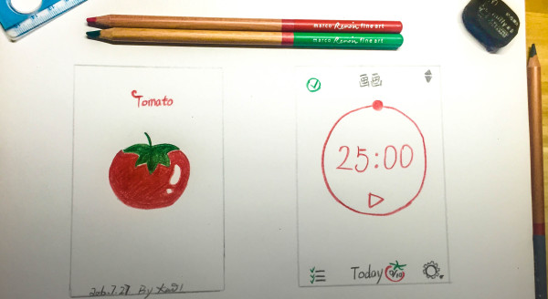
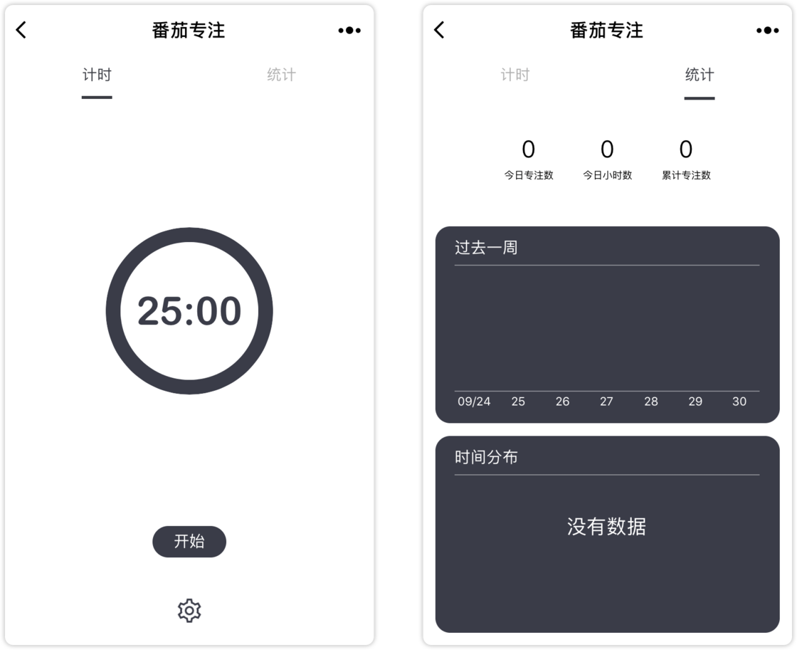

# 程序员的番茄工作法

> 番茄工作法，是一款简单易行的时间管理方法，是由弗朗西斯科·西里洛在 1992 年创立的一种相对于 GTD 更微观的时间管理方法。

简单来说，番茄工作法就是以 **番茄时间** 为单位，一个番茄时间即为 **25 min**，专注工作 **25** 分钟，休息 **5** 分钟，如此循环反复，当看到自己一天所完成的番茄时间个数时，自然成就感满满。这种专注有效的工作法，被很多职场人推崇。

**但是这种工作法，是否真的适合需求与 BUG 横飞的程序员呢？**

## 番茄工作法的内涵

1. 将一天的工作任务列成清单

2. 使用番茄计数软件（推荐小程序 **番茄专注**）

3. 完成一项任务，番茄时钟响起

4. 划掉已完成的任务

5. 休息 5 min，带薪喝水，带薪拉屎，带薪玩手机...

6. 开启下一个番茄时间，直到完成全部任务

7. 每四个番茄时间后，需要休息大补 25 min

**番茄时间** 有助于我们减轻对时间的焦虑，使我们集中注意力攻坚克难，最终达到提升工作效率和质量的目的。它是一种科学有效的工作方法，只要我们长期坚持，形成一种工作习惯后，它往往会使我们的工作和学习起到事半功倍的效果。

## 程序员工作的特殊性

作为程序员，我们在工作中免不了被产品经理突如其来的奇葩需求所打断，或者需要与其他同类沟通，那是不是我们就无法保证 **专注时间** 了呢？

笔者认为程序员更适合按照 **功能点** 分配番茄时间，因为番茄时间间隔比较小 ( 25 min )，而程序员遇到某个功能点时，需要连续的思考，如果这个时候思维被打断，确实开发体验会非常差。

或许增加时间间隔，更加适合 Coder 们。

## 定制 Todo List

作为互联网人，细分领域如此之多，后端，前端，产品经理，设计师... 每种细分职位对番茄工作法的理解不尽相同。

但是，番茄工作法确实给我们带来了很多启示：

> 列举任务清单，拆解大任务，按照预定时间各个击破

其核心是 **列举任务清单** 即 **Todo List**。

**相信只要我们结合自身情况，设定合理的番茄时间，并持续坚持投入，学习和工作效率一定会有一个质的飞跃。**